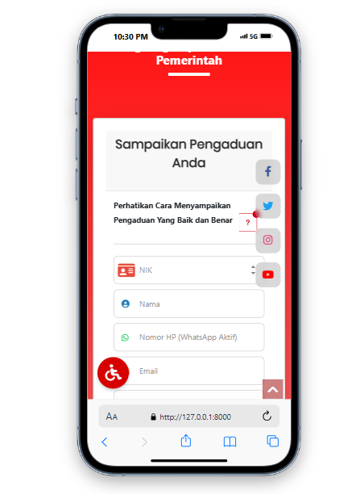
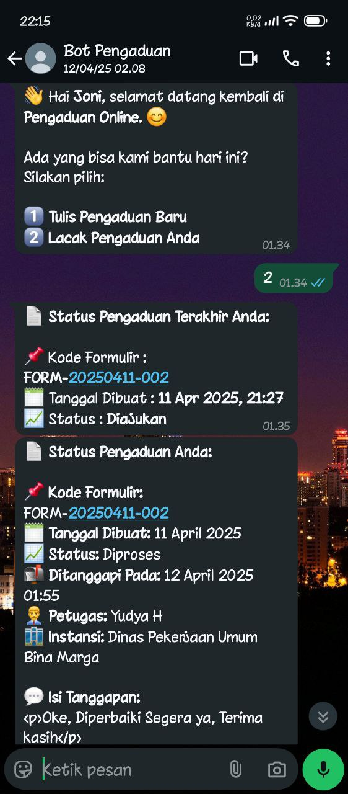

# 📢 Sistem Informasi Pengaduan Masyarakat

Sistem ini merupakan aplikasi pengelolaan pengaduan masyarakat yang dapat diakses melalui **web** dan **bot WhatsApp**, 
dibangun dengan kombinasi teknologi modern backend dan frontend untuk memberikan pengalaman pengguna yang cepat, responsif, dan cerdas.

---

## 📌 Spesifikasi Proyek

| 💻 Komponen         | 🛠️ Teknologi                                                                 |
|---------------------|------------------------------------------------------------------------------|
| ⚙️ Framework Backend |  [Laravel 8](https://laravel.com) |
| 🧠 Bahasa Pemrograman |  PHP v8.1              |
| 📊 Machine Learning |  Flask (Python)    Scikit-learn    Pandas |
| 🌐 Web Server       |  Apache (via XAMPP) |
| 🛢️ Database         |  MySQL/MariaDB |
| 🎨 Frontend         |  jQuery    Bootstrap |
| 📡 API Komunikasi   |  WhatsApp Bot API |

---

## 📁 Menu Utama

- 📬 **Pengaduan via Web** – Formulir laporan pengaduan untuk masyarakat
- 🤖 **Pengaduan via WhatsApp Bot** – Integrasi dengan Bot WhatsApp untuk pelaporan cepat
- 📊 **Dashboard Admin** – Pantauan status pengaduan dan analitik singkat
- 🧠 **Klasifikasi AI** – Sistem cerdas untuk mendeteksi pengaduan *Spam* atau *Valid*
- 👨‍💼 **Manajemen Pengguna** – Pengelolaan akun admin dan operator

---

## 🖼️ Tampilan Antarmuka

| Dashboard | WhatsApp Bot |
|----------|---------------|
|  |  |

---

## 🚀 Cara Menjalankan Proyek

1. **Clone repo ini:**
   - git clone https://github.com/username/sipadu.git
   - cd sipadu
   
2. Instalasi Laravel & Composer:
	- composer install
	- cp .env.example .env
	- php artisan key:generate

3. Setup Database:
	- Buat database sipadu
	- Jalankan migrasi:
		php artisan migrate --seed

4. Jalankan Flask ML Backend
	- pip install flask-cors
	- pip install scikit-learn
	- pip install pandas scikit-learn imbalanced-learn xgboost lightgbm
	- pip install -r requirements.txt
	- python -m venv venv
	- venv\Scripts\activate
	- python backend/train_mod.py
	- python backend/app.py

5. Jalankan Laravel server:
	- php artisan serve
	

🤖 Integrasi WhatsApp Bot
API WhatsApp digunakan untuk menerima pengaduan via pesan
Dukungan auto-reply, klasifikasi, dan integrasi langsung ke database

✨ Kontribusi
Pull request dan ide baru sangat diterima! Silakan fork repo ini dan kirim perubahan yang kamu rasa bermanfaat.

📄 Lisensi
Proyek ini menggunakan lisensi MIT – bebas digunakan dengan menyertakan atribusi.
=======
| Dashboard | Formulir Pengaduan | WhatsApp Bot |
|----------|--------------------|---------------|
|  |  |

> 📸 Ganti gambar di atas dengan tangkapan layar dari folder `images/`

---

## 🚀 Cara Menjalankan Proyek

1. **Clone repo ini:**
   - git clone https://github.com/username/sipadu.git
   - cd sipadu
   
2. Instalasi Laravel & Composer:
	- composer install
	- cp .env.example .env
	- php artisan key:generate

3. Setup Database:
	- Buat database sipadu
	- Jalankan migrasi:
		php artisan migrate --seed

4. Jalankan Flask ML Backend
	- pip install flask-cors
	- pip install scikit-learn
	- pip install pandas scikit-learn imbalanced-learn xgboost lightgbm
	- pip install -r requirements.txt
	- python -m venv venv
	- venv\Scripts\activate
	- python backend/train_mod.py
	- python backend/app.py

5. Jalankan Laravel server:
	- php artisan serve
	

🤖 Integrasi WhatsApp Bot
API WhatsApp digunakan untuk menerima pengaduan via pesan
Dukungan auto-reply, klasifikasi, dan integrasi langsung ke database

✨ Kontribusi
Pull request dan ide baru sangat diterima! Silakan fork repo ini dan kirim perubahan yang kamu rasa bermanfaat.

📄 Lisensi
Proyek ini menggunakan lisensi MIT – bebas digunakan dengan menyertakan atribusi.